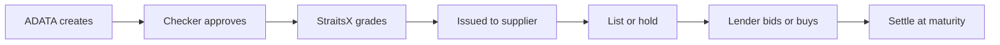

# ADATA Tokenised Payables

A clickable demo of the ADATA tokenised payables programme. Project BLOOM,
StraitsX with ADATA and BaaS Innovations.

> Fictional throughout. No funds move and nothing touches a blockchain.
> Every hash, block number, and receipt is labelled simulated on screen.

Built against [`tokenised-payable-prd.md`](tokenised-payable-prd.md). Where the
PRD is silent or points at a section that does not exist, the decision taken is
recorded in [`docs/ASSUMPTIONS.md`](docs/ASSUMPTIONS.md). The five-minute
presenter script is [`docs/RUNBOOK.md`](docs/RUNBOOK.md).



## Run it locally

You need Node 20+ and Postgres 16. `DATABASE_URL` (or `POSTGRES_URL`) is the
only required environment variable.

**Any Postgres**, including a hosted one:

```bash
npm install
export DATABASE_URL="postgresql://USER@127.0.0.1:5432/adata"
npm run dev
```

The first request against a database with no `app.world` row loads
`db/schema.sql`, `db/post.sql`, and `db/fixtures.sql` (ADATA, StraitsX, and the
three acting accounts). It does not load the demo catalogue. Switch to the
StraitsX admin persona and use **Reset world** to load `db/seed.sql`.

**Linux helper** (system Postgres; this is also what `npm test` uses):

```bash
npm install
scripts/db.sh reset          # start Postgres, load the schema, seed the world
export DATABASE_URL="$(scripts/db.sh url)"
npm run dev                  # or: npm run serve  (reset, build, serve on :3100)
```

Then open the app and use the **Demo controls** bar at the top to switch
persona, move the clock, top up a wallet, create a new account, or reset the
world.

## What is in it

Nineteen routes across five personas (ADATA preparer, ADATA checker, supplier,
lender, StraitsX admin). They cover every screen PRD §8 lists, plus accounts,
the mock explorer, and reset.

| Persona | Route | What |
|---|---|---|
| ADATA | `/adata` | Outstanding obligations |
| | `/adata/create` | ERP import or manual entry |
| | `/adata/approvals` | Maker-checker queue |
| | `/adata/settlement` | Maturity funding |
| Supplier | `/supplier` | Inbox, holdings, financing comparison |
| | `/supplier/finance/[id]` | List whole or part, optional buy-now |
| | `/supplier/offers` | Bids received |
| Lender | `/lender` | Marketplace: maturity, tenor, grade, ticket, yield |
| | `/lender/[id]` | Detail, series expansion, bid or buy now (USDC, USDT, XSGD, XUSD) |
| | `/lender/portfolio` | Holdings and realised returns |
| StraitsX admin | `/admin` | Programme oversight |
| | `/admin/certification` | Issuer certification |
| | `/admin/grading` | AAA / AA / A |
| | `/admin/accounts` | Users |
| | `/overdue` | Sample recovery case |
| Shared | `/onboarding` | Custodial wallet |
| | `/transfer` | Peer-to-peer quantity |
| | `/explorer` | Mock chain receipts |
| | `/reset` | Restore the seed |

The seeded world (`db/seed.sql`, asserted by `tests/ledger/seed.sql`):

| What | Seeded |
|---|---|
| Organisations | 26 |
| Accounts | 19 |
| Payables | 29, across AAA, AA, and A, with 30 to 180 day tenors |
| Open listings | 9, including a 12-invoice series lot and one listing with competing bids |
| ERP invoices | 24, unissued |
| Showcase rows | one settled position, one overdue position |

T0 is the day the world was seeded, so the tenors stay realistic however long
the URL stays up.

## Verify it

```bash
npm test                     # unit, schema, ledger, invariants, concurrency
npm run verify:screens       # every screen, every persona, in a real browser
npm run verify:runbook       # the whole runbook, driven click by click
```

`npm test` uses `scripts/db.sh`, so it needs the Linux helper above. The last
two commands need the app running (`npm run serve`, or `scripts/serve.sh --keep`
to leave an existing world alone).

## Deploy to Vercel

1. Provision Postgres from the Vercel Marketplace (Neon or Supabase). Use the
   **pooled** connection string. Each serverless instance opens its own pool,
   and instances scale out under load.
2. Set `DATABASE_URL` in the project's environment variables. `POSTGRES_URL` is
   accepted as a fallback.
3. Deploy. The first request bootstraps schema and fixtures if `app.world` is
   missing. There is no `psql` step, and the build does not touch the database.
4. Set `ADATA_RESET_PIN` if the URL will be public. Reset restores the seed for
   every connected session. Only the StraitsX admin persona can arm it, and only
   by typing RESET. The persona switcher is open by design (PRD §11), so anyone
   can become that admin. The PIN is the only gate a stranger cannot walk
   through. Leave it unset for a laptop demo; the reset screen says so plainly.

`Reset world` replays `db/schema.sql`, `db/post.sql`, and `db/seed.sql` through
the driver in one transaction.

### Neon

Use the host with `-pooler` in it as `DATABASE_URL`. Neon's pooler runs in
transaction mode, which matches this app: every write is a single
`ledger.post()` call in one transaction, and nothing depends on session state
between requests.

The free tier suspends a database after five minutes idle. The first query
after that pays a cold start of a second or two. For a demo that must open
instantly, keep a tab open or disable scale-to-zero on the branch.

The database owner often cannot `CREATE ROLE`. Schema load then skips the
`adata_app` nologin role; the connecting user owns the objects and the app
still runs. `adata_app` is created when the owner has `CREATEROLE`, which is
how a laptop `psql` against local Postgres behaves.

`PG_POOL_MAX` defaults to 1 connection per instance. Raise it only if you have
measured a need and the database can take the total.

## How it fits together

```
src/core/        domain: money, pricing, lifecycle, clock. No I/O, no React.
src/db/          the only way in and out. post() writes, read() reads.
src/app/         routes and server actions. Thin shells over the two above.
src/components/  shell, demo controls, shared UI.
db/              schema.sql, post.sql, fixtures.sql, seed.sql
tests/           SQL suites against a real Postgres, plus browser drivers
```

Three decisions carry most of the weight.

**Money is a branded `bigint` of base units**, where 1.0000 XUSD is 10,000
units. TypeScript refuses to mix `bigint` with `number`, so a float in the money
path stops compiling rather than silently rounding. The driver is configured to
hand back `BIGINT` and `SUM()` as `bigint` for the same reason, and `npm test`
fails if any money column is declared `numeric`, `real`, or `double precision`.

**Balances are derived from an append-only journal**, not stored and edited.
`ledger.account_balance` is a projection maintained by a trigger, and
`ledger.prove_books_balance()` asserts it equals the journal for every row. The
admin screen runs that proof live: the figures on screen are a fold of the
transaction log and nothing else.

**One function writes.** `ledger.post()` is the single write path. When
`adata_app` exists, that role has no write grant on any ledger table, so
"always post through the ledger" is a privilege rather than a convention. The
lock ordering that makes concurrent acceptance safe lives in one function you
can read end to end.

## What is deliberately not here

Real blockchain connectivity, real KYC, ERP integration, a production credit
model, coupons, early buyback, partial maturity settlement, and operational
recovery workflows. All out of scope per PRD §4.

The platform is intended to be ported to Sepolia for real testnet transactions
under a later PRD. The read model is shaped for that: a journal entry is already
a `TransferSingle`-shaped record with a transaction hash and block number, so
the port replaces the write path with an indexer rather than reshaping the data.
[`docs/design/LEDGER.md`](docs/design/LEDGER.md) says what that port does not
give for free.
